# 🌐 Movies Info - Web Scraping Module

[](https://www.python.org/downloads/)
[](https://www.crummy.com/software/BeautifulSoup/)
[](https://requests.readthedocs.io/)
[](https://github.com)

## 📋 Overview

**Web scraping utility for extracting movie metadata from Cinépolis Chile's website.** This module automatically downloads and processes movie information, creating structured datasets for movie enrichment and analysis purposes.

**Key capabilities:**
- Automated movie metadata extraction from cinema websites
- Structured data organization with standardized formats
- Integration with movie standardization pipeline
- Sample movie dataset with 18 pre-processed movies

## 🗂️ Directory Structure

```
MOVIES_INFO/
├── movies/
│   ├── .gitkeep                    # 📁 Directory structure
│   ├── 200-LOBO/                   # 🎬 Sample movie data
│   │   ├── description.txt         # 📄 Complete page content
│   │   ├── webpage.txt             # 🔗 Movie page URL
│   │   └── texto_estructurado.txt  # 📋 Structured metadata
│   ├── BTS-2016-HYYH-ON-STAGE-EPILOGO/
│   ├── DEMON-SLAYER-CASTILLO-INFINITO/
│   └── ... (18 sample movies total)
├── main_page.html                  # 🌐 Cached main page
├── wget.py                         # 🔧 Web scraping engine
├── requirements.txt                # 📦 Python dependencies
└── README.MD                       # 📚 This documentation
```

## 🔧 Features

- **Automated Web Scraping**: Downloads main page from Cinépolis Chile
- **URL Extraction**: Identifies all available movie URLs automatically
- **Structured Processing**: Extracts relevant information from each movie page
- **Organized Storage**: Creates individual folders for each movie
- **Triple Output Format**: Generates three complementary files per movie:
  - `description.txt`: Complete text content from the movie's page
  - `webpage.txt`: The exact URL of the movie page
  - `texto_estructurado.txt`: Formatted structured data with key movie information
- **Data Quality**: Handles special characters and ensures valid file names
- **Incremental Updates**: Automatically updates existing movie information when re-run

## 🚀 Quick Start Guide

### Prerequisites
```bash
# Install required dependencies
pip install -r requirements.txt
```

## 💻 Usage

### Run the Web Scraper

```bash
cd MOVIES_INFO
python wget.py
```

**The script will:**
1. Download the Cinépolis Chile main page
2. Extract all movie URLs automatically
3. Process each movie page for metadata extraction
4. Create/update individual movie folders with structured data

### Current Dataset

The `/movies` directory contains **18 sample movies** with complete metadata:
- Individual movie folders with structured metadata
- Each folder contains: `description.txt`, `webpage.txt`, `texto_estructurado.txt`
- Ready for integration with movie standardization pipeline

## 📊 Data Processing Pipeline

```mermaid
graph TD
    A["Cinépolis Chile\nMain Page"] --> B["URL Extraction\nwget.py"]
    B --> C["Movie Page\nProcessing"]
    C --> D["Metadata Extraction"]
    D --> E["Structured Storage\n/movies folders"]
    E --> F["Integration with\nMovie Standardizer"]
```



## 📋 Output Data Structure

### Structured Information Format

Each movie folder contains three complementary files:

#### `texto_estructurado.txt` - Standardized Metadata
```
1 nombre pelicula: [MOVIE TITLE]
2 Restriccion Edad: [AGE RESTRICTION]
3 duracion: [DURATION] min
4 categoria: [GENRE]
5 Sinopsis: [PLOT SUMMARY]
6 Actores: [ACTORS LIST]
7 Directores: [DIRECTORS LIST]
```

#### `description.txt` - Complete Page Content
- Full text content extracted from the movie's webpage
- Unprocessed raw data for advanced analysis

#### `webpage.txt` - Source URL
- Direct link to the original movie page
- Enables data verification and re-scraping

## 🔧 Technical Implementation

### Core Technologies
- **requests**: HTTP client for downloading web pages
- **BeautifulSoup4**: HTML parsing and data extraction
- **Regular expressions**: Pattern matching for structured information extraction
- **File I/O**: Organized data storage and management

### Robust Error Handling
- **Page Structure Variations**: Adapts to different movie page layouts
- **Character Encoding**: Handles special characters in movie titles
- **Missing Data**: Graceful handling of incomplete information fields
- **Network Resilience**: Error handling for connection failures and timeouts
- **File System**: Safe file naming and directory creation

## 🔗 Integration

This module integrates seamlessly with the **Movie Standardizer** pipeline:
- Provides enriched metadata for movie catalog enhancement
- Supplies structured data for deduplication processes
- Enables automated movie information updates

---

## ⚠️ Usage Guidelines

This tool is designed for data analysis and research purposes. Please respect website terms of service and implement appropriate rate limiting to avoid server overload.

---

## 📄 License

Proprietary - Internal Use Only

---

## 👥 Team

Developed by the Data Engineering Team

For questions or support, please contact the development team.

---

*Last Updated: December 2024*

