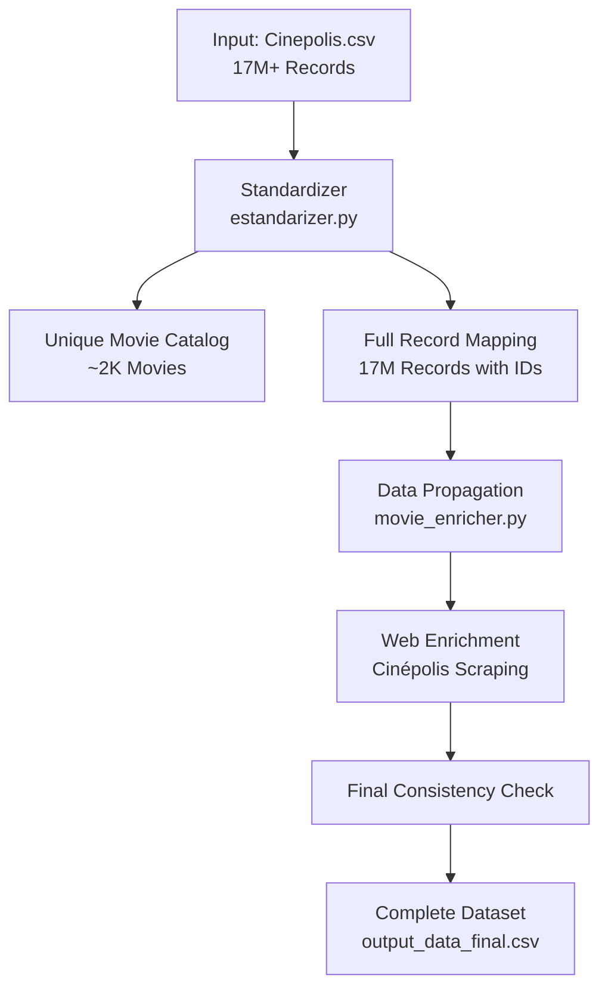
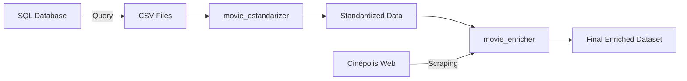

# Help Frida - Multi-Module Data Processing Repository


## 📋 Repository Overview

This repository contains three specialized data processing modules for different analytical purposes:

1. **Movie Standardizer** - Cinema transaction deduplication and enrichment
2. **Order Range Recognition** - Bayesian payment amount analysis
3. **Movies Info** - Web scraping utilities for movie metadata

## 🗂️ Repository Structure

```
help_frida/
├── movie_estandarizer/        # 🎬 Movie standardization and enrichment
├── order_range_recognition/   # 💳 Payment amount range analysis
├── MOVIES_INFO/               # 🌐 Movie metadata scraping
└── README.md                  # 📚 This documentation
```

---

## 🎬 Module 1: Movie Standardizer (`movie_estandarizer/`)

### Purpose
**This framework transforms 17+ million transactional cinema records into a deduplicated, standardized movie catalog, enabling robust analytics and business intelligence on unique film titles rather than individual transactions.**

The system automatically identifies and consolidates **multiple movie name variations** into canonical representations, solving the critical challenge of:

- **Name Variation Management**: Consolidates "Superman Esp", "Superman ESP", "Superman 4DX/3D" into a single entity
- **Format-agnostic Deduplication**: Groups all versions (2D, 3D, 4DX, IMAX) of the same movie
- **Language Variant Unification**: Merges ESP, SUB, and DUB versions under unified movie families
- **Enrichment Pipeline**: Provides structure for metadata augmentation from external sources
- **Scalable Processing**: Handles 5GB+ input files with streaming architecture

### Directory Structure
```
movie_estandarizer/
├── input_data/
│   ├── Cinepolis.csv          # ⚠️ Input data (execute SQL query first)
│   └── input_query.sql        # SQL query to obtain data
├── output_data/
│   ├── example_output_data.csv    # Template file (auto-created if missing)
│   ├── output_data.csv            # Unique movies catalog
│   ├── output_data_all.csv        # All records with IDs
│   └── output_data_final.csv      # Enriched final output
├── estandarizer.py            # Core standardization engine
├── movie_enricher.py          # Web enrichment module
├── complete_pipeline.py       # Full automated pipeline
├── requirements.txt           # Python dependencies
└── README.md                  # Detailed module documentation
```

### 🏗️ Core Transformation Principle

**The fundamental concept is multi-level title normalization with intelligent deduplication:**

#### Hierarchical Normalization Strategy

```
Original Transaction → Movie Name → Clean Title → Family Group → Unique Identifier
"Superman 4DX/3D Esp" → "SUPERMAN 4DX/3D ESP" → "SUPERMAN" → "SUPERMAN" → ID:123
"Superman Esp"        → "SUPERMAN ESP"        → "SUPERMAN" → "SUPERMAN" → ID:123
"Superman IMAX Sub"   → "SUPERMAN IMAX SUB"   → "SUPERMAN" → "SUPERMAN" → ID:123
```

This multi-tier approach ensures **robust deduplication** while preserving format and language information for business analytics.

### 📊 Processing Pipeline



### 🔄 Three Processing Modes

#### 1️⃣ Complete Pipeline (Recommended)
```bash
cd movie_estandarizer
python complete_pipeline.py
```
- Processes ALL 17M+ records
- Maps each to unique movie IDs
- Enriches data from web sources
- Ensures final consistency
- Output: `output_data_final.csv`

#### 2️⃣ Catalog Mode (Unique Movies Only)
```bash
python estandarizer.py
```
- Extracts ~2,000 unique movies
- Creates deduplicated catalog
- Output: `output_data.csv`

#### 3️⃣ Full Mapping Mode (All Records)
```bash
python estandarizer.py --all-records
```
- Processes ALL records
- Maintains transaction-level detail
- Maps to unique movie IDs
- Output: `output_data_all.csv`

### 🚀 Quick Start Guide

#### Step 1: Prepare Input Data
```bash
# Execute SQL query and save results
1. Run query from: input_data/input_query.sql
2. Export to CSV: input_data/Cinepolis.csv
```

#### Step 2: Run Processing
```bash
# Complete pipeline (recommended)
cd movie_estandarizer
python complete_pipeline.py
```

### 💻 Core Components

1. **MovieStandardizer Class** (`estandarizer.py`)
   - Multi-level normalization algorithms
   - Format and language extraction
   - Family detection
   - Movie ID assignment
   - Batch processing of large files

2. **MovieEnricher Class** (`movie_enricher.py`)
   - Data propagation between related records
   - Google search for missing information
   - Web scraping from Cinépolis website
   - Structured data extraction
   - Final consistency validation

3. **Complete Pipeline** (`complete_pipeline.py`)
   - Orchestrates the entire process
   - Integrates standardization and enrichment
   - Error handling and recovery
   - Performance optimization
   - Comprehensive logging

### 🔧 Advanced Features

- **Missing File Handling**: Auto-creates empty templates
- **Input Validation**: Checks for required columns
- **Consistency Enforcement**: Ensures data integrity
- **Batch Optimization**: Processes 500K records at a time
- **Robust Error Recovery**: Continues on partial failures

### ✅ Output Files
- `output_data_all.csv`: All 17M records with movie IDs
- `output_data_final.csv`: Enriched complete dataset
- `output_data.csv`: Unique movies catalog only

> 📁 **Sample Output Data**: A sample version of the processed movie data (`output_data.csv`) is available on [Google Drive](https://drive.google.com/drive/folders/1FzNKnWKWpBXWzYgMD24FJCjkY8wIcwtW?usp=drive_link) for reference and testing.

---

## 💳 Module 2: Order Range Recognition (`order_range_recognition/`)

### Purpose
Identifies optimal payment amount ranges using Bayesian histogram optimization for statistical analysis and business intelligence.

### Directory Structure
```
order_range_recognition/
├── query_output/
│   └── ECR.csv                # Query results (if any)
├── ia_AR_order_amount_range_of_interest.sql   # Acceptance Rate analysis
├── ia_ECR_order_amount_range_of_interest.sql  # Effective Cost Rate analysis
└── README.md                  # Module documentation
```

### 🚀 Usage

#### Step 1: Execute SQL Queries

**For Acceptance Rate Analysis**:
```sql
-- Execute: order_range_recognition/ia_AR_order_amount_range_of_interest.sql
-- Export results to: order_range_recognition/query_output/AR.csv
```

**For Effective Cost Rate Analysis**:
```sql
-- Execute: order_range_recognition/ia_ECR_order_amount_range_of_interest.sql  
-- Export results to: order_range_recognition/query_output/ECR.csv
-- (REPLACE the existing sample ECR.csv file)
```

#### Step 2: Customize Parameters
- Replace `COMMERCE_ID` parameter in both SQL files with your target merchant ID
- Current default: `'9ea20bdb-5cff-4b10-9c95-9cebf8b6ddb4'`

### Key Features
- Bayesian optimal binning
- Logarithmic transformation for skewed data
- Automatic gap detection
- Strategic interval categorization (LARGE/MEDIUM/SMALL)

### Output
- Contiguous payment ranges without gaps
- Statistically optimal intervals
- Ready for A/B testing and sampling

---

## 🌐 Module 3: Movies Info (`MOVIES_INFO/`)

### Purpose
Web scraping utilities for extracting movie metadata from Cinépolis Chile website.

### Directory Structure
```
MOVIES_INFO/
├── movies/                    # Scraped movie data
│   ├── 200-LOBO/
│   │   ├── description.txt
│   │   ├── texto_estructurado.txt
│   │   └── webpage.txt
│   └── [other movies...]
├── wget.py                    # Main scraping script
├── main_page.html            # Cached main page
└── README.MD                 # Module documentation
```

### 🚀 Usage

```bash
cd MOVIES_INFO
python wget.py

# The script will:
# 1. Download Cinépolis main page
# 2. Extract movie URLs
# 3. Scrape each movie's metadata
# 4. Save structured data in movies/
```

### Extracted Data
For each movie:
- `description.txt`: Full page text
- `texto_estructurado.txt`: Structured metadata
  - Movie name
  - Age restriction
  - Duration
  - Category
  - Synopsis
  - Actors
  - Directors
- `webpage.txt`: Source URL

### Key Features
- Automatic movie discovery
- Structured data extraction
- Rate limiting to avoid server overload
- Error handling and recovery

---

## 🔧 Installation & Setup

### Prerequisites
```bash
# Python 3.8+
python --version

# Install dependencies for each module
cd movie_estandarizer
pip install -r requirements.txt
```

### Required Python Packages
```python
pandas>=2.0.0
numpy>=1.24.0
requests>=2.28.0
beautifulsoup4>=4.11.0
tqdm>=4.65.0
```

---

## 📊 Data Flow



---

## 🚦 Processing Pipeline

### Complete Workflow

1. **Data Extraction**
   ```sql
   -- Run SQL queries to get raw data
   -- Export to CSV format
   ```

2. **Standardization**
   ```bash
   cd movie_estandarizer
   python estandarizer.py --all-records
   ```

3. **Enrichment**
   ```bash
   python movie_enricher.py
   # Or run complete pipeline:
   python complete_pipeline.py
   ```

4. **Analysis**
   ```sql
   -- Run order range recognition queries
   -- Analyze payment patterns
   ```

---

## 📈 Performance Metrics

### Movie Standardizer
- **Input**: 17M+ records (5GB)
- **Output**: ~2,000 unique movies
- **Processing**: ~200,000 records/second
- **Memory**: 4GB RAM max
- **Time**: 15-20 minutes total

### Web Scraping
- **Speed**: ~50 movies/minute
- **Success Rate**: ~80% extraction
- **Retry Logic**: Automatic on failures

---

## 🔍 Key Algorithms

### Movie Deduplication
```python
# Multi-level normalization
Raw Name → TITULO_LIMPIO → NOMBRE_UNICO → FAMILIA
"Superman 4DX Esp" → "SUPERMAN 4DX ESP" → "SUPERMAN" → "SUPERMAN"
```

### Bayesian Binning
```sql
-- Knuth's Bayesian optimization
-- Finds optimal bin count M*
-- Maximizes marginal likelihood
-- No arbitrary parameters needed
```

---

## 🛡️ Error Handling

### Missing Input Files
```bash
❌ ERROR: Input file not found!
Please follow these steps:
1. Execute the SQL query
2. Export results to CSV
3. Save to appropriate location
```

### Automatic Recovery
- Creates missing directories
- Generates empty templates
- Continues on partial failures
- Logs all errors for review

---

## 📝 Logging

All modules generate detailed logs:
- `movie_standardizer.log`
- `movie_enricher.log`
- `complete_pipeline.log`

---

## 🔒 Data Privacy

**Important**: CSV files containing data are excluded from version control.
- All `.csv` files are gitignored
- Only code and documentation are tracked
- Sensitive data remains local

---

## 🚀 Future Enhancements

### Planned Features
- [ ] Direct SQL database integration
- [ ] Real-time processing pipeline
- [ ] API endpoints for data access
- [ ] Machine learning for movie matching
- [ ] Automated scheduling with cron
- [ ] Dashboard for monitoring

### Integration Points
- PostgreSQL/MySQL connectors
- TMDb/OMDb API integration
- Cloud storage (S3/GCS)
- Message queue integration

---

## 🤝 Contributing

### Adding New Modules
1. Create module directory
2. Add README with documentation
3. Include requirements.txt
4. Update main README

### Code Standards
- Python 3.8+ compatibility
- Type hints where applicable
- Comprehensive logging
- Error handling
- Unit tests (when applicable)

---

## 📄 License

Proprietary - Internal Use Only

---

## 👥 Team

Developed by the Data Engineering Team

For questions or support, please contact the development team.

---

## 📊 Summary Statistics

### Repository Metrics
- **Total Modules**: 3
- **Processing Capacity**: 17M+ records
- **Unique Movies**: ~2,000
- **Processing Speed**: 200K records/sec
- **Web Scraping**: 50 movies/min

### Data Volume
- **Input**: 5GB+ CSV files
- **Output**: Multiple enriched datasets
- **Memory**: 4GB RAM maximum
- **Storage**: 6GB total required

---

*Last Updated: December 2024*

**The fundamental concept behind this analytical framework is based on Bayesian optimal histogram binning applied to two distinct but complementary payment analysis domains:**

### Dual Analysis Approach

This framework implements **two specialized analytical modules** that address different strategic business questions:

1. **Acceptance Rate (AR) Analysis** - `ia_AR_order_amount_range_of_interest.sql`
2. **Effective Cost Rate (ECR) Analysis** - `ia_ECR_order_amount_range_of_interest.sql`

Both modules share the same **Knuth Bayesian methodology** but analyze different aspects of payment processing:

- **AR Module**: Analyzes **declined/rejected orders** to identify payment amount ranges with highest rejection frequency
- **ECR Module**: Analyzes **approved orders** to identify payment amount ranges with highest processing cost concentration

### Unified Statistical Foundation

The Knuth Bayesian method provides a **mathematically principled approach to find the optimal number of bins** that balances model complexity against data fit. By maximizing Bayesian evidence, we automatically discover the natural structure in payment distributions without arbitrary parameter choices.

The analytical process follows these principles:

1. **Logarithmic Transformation**: Handle extreme right-skew in payment amounts through log-scale analysis
2. **Bayesian Optimization**: Find optimal bin count M* that maximizes marginal likelihood
3. **Frequency-weighted Filtering**: Focus on bins contributing to 90% of target metric (rejections or costs)
4. **Two-stage Refinement**: Apply Bayesian optimization twice for robust interval identification
5. **Strategic Categorization**: Generate LARGE, MEDIUM, and SMALL intervals for different business approaches

**This sophisticated statistical approach transforms continuous payment amount data into actionable strategic intervals, enabling targeted optimization based on transaction patterns.**

## Overview

The Order Amount Range Analysis framework implements an advanced Bayesian statistical methodology through **two complementary analytical modules**:

### Module 1: Acceptance Rate (AR) Analysis
**File**: `ia_AR_order_amount_range_of_interest.sql`

**Purpose**: Identifies payment amount ranges with the highest concentration of **declined/rejected orders** to understand where payment failures occur most frequently.

**Business Applications**:
- Risk assessment and fraud prevention strategy
- Payment method optimization for specific amount ranges
- Merchant onboarding guidelines based on transaction patterns
- Dynamic routing strategies to improve acceptance rates

### Module 2: Effective Cost Rate (ECR) Analysis
**File**: `ia_ECR_order_amount_range_of_interest.sql`

**Purpose**: Identifies payment amount ranges with the highest concentration of **processing costs** to optimize cost efficiency across transaction values.

**Business Applications**:
- Cost optimization and fee structure analysis
- Processor selection strategies by amount range
- Pricing model development for different transaction sizes
- Strategic cost reduction targeting

### Unified Output Structure

Both modules produce consistent output formats with three strategic interval types:
- **LARGE**: Full range covering 90% of target metric
- **MEDIUM**: Range covering up to 80% cumulative concentration
- **SMALL**: Single highest-frequency/highest-impact bin

This enables payment strategists to identify precise transaction value ranges where optimization efforts will have the greatest impact on either **acceptance rates** or **cost efficiency**.

## Implementation Details

### Key Components

#### Acceptance Rate (AR) Analysis Module
**File**: `ia_AR_order_amount_range_of_interest.sql`

**Core Functionality**:
- Analyzes **declined/rejected orders** from the past 6 months
- Joins `VW_ATHENA_ORDER_` with `VW_ATHENA_ACCEPTANCE_RATE_PROCESSOR_`
- Identifies payment amount ranges with highest rejection frequency
- Applies two-stage Bayesian optimization (logarithmic → linear scale)
- Generates strategic intervals for acceptance rate optimization

**Key Features**:
- Filters to `ORDER_STATUS = 'DECLINED'` for rejection analysis
- Uses payment error categories for enhanced analysis
- Implements continuous interval detection for longest rejection sequences
- Produces LARGE/MEDIUM/SMALL intervals based on rejection concentration

#### Effective Cost Rate (ECR) Analysis Module
**File**: `ia_ECR_order_amount_range_of_interest.sql`

**Core Functionality**:
- Analyzes **approved orders** with associated processing fees
- Joins `VW_ATHENA_ORDER_` with `VW_ATHENA_PAYMENT_PROCESSOR_FEE`
- Calculates ECR as `ORDER_PROCESSOR_FEE_USD / TOTAL_GLOBAL_GMV`
- Identifies payment amount ranges with highest cost concentration
- Applies identical Bayesian methodology for cost optimization

**Key Features**:
- Filters to `ORDER_APPROVED_INDICATOR = TRUE` for cost analysis
- Calculates global GMV and processor fees for ECR computation
- Implements ECR-weighted filtering for cost-focused optimization
- Produces strategic intervals for cost reduction targeting

### Shared Statistical Framework

Both modules implement identical **advanced two-stage Bayesian histogram optimization**:
- Statistical identification of optimal bin counts using Knuth method
- Robust mathematical approach adapting to complex payment distributions
- Computational efficiency through pre-aggregation techniques

### Analytical Framework Architecture

#### 1. Data Preparation

**AR Module (Rejection Analysis)**:
- Uses 6 months of order data from `VW_ATHENA_ORDER_` and `VW_ATHENA_ACCEPTANCE_RATE_PROCESSOR_`
- Extracts order details, payment amounts, and rejection reasons
- Filters to declined orders (`ORDER_STATUS = 'DECLINED'`)
- Includes payment error categories and processor information
- Adds recency flags for trend analysis

**ECR Module (Cost Analysis)**:
- Uses 6 months of approved order data from `VW_ATHENA_ORDER_` and `VW_ATHENA_PAYMENT_PROCESSOR_FEE`
- Extracts order details, payment amounts, and processor fees
- Filters to approved orders (`ORDER_APPROVED_INDICATOR = TRUE`)
- Calculates global GMV and ECR metrics for relative comparisons
- Computes `ORDER_EFFECTIVE_COST_RATE = ORDER_PROCESSOR_FEE_USD / TOTAL_GLOBAL_GMV`

#### 2. Logarithmic Transformation

**Both modules** apply identical logarithmic transformation to handle the extreme right skew typical in payment amounts:

$$y = \ln(\text{PaymentAmountUSD})$$

This transformation:
- **Stabilizes variance** across the payment amount range
- **Enables meaningful analysis** of both small and large transactions
- **Converts multiplicative relationships** into additive ones
- **Improves Bayesian convergence** for optimal bin detection

**AR Module Application**: Applied to declined order amounts for rejection pattern analysis
**ECR Module Application**: Applied to approved order amounts for cost pattern analysis

#### 3. Bayesian Binning Algorithm

**Both modules** use the identical Knuth Bayesian method to identify optimal bin count by maximizing:

$$\displaystyle F(M) = N \ln(M) + \ln \Gamma\left(\frac{M}{2}\right) - M \ln \Gamma\left(\frac{1}{2}\right) - \ln \Gamma\left(\frac{N+M}{2}\right) + \sum_{k=1}^{M} \ln \Gamma\left(n_k + \frac{1}{2}\right)$$

Where:
- $M$ is the number of bins to evaluate (range: 64 to 4,096)
- $N$ is the total sample size (declined orders for AR, approved orders for ECR)
- $n_k$ is the count of observations in bin $k$
- $\Gamma$ is the gamma function (approximated using Stirling's method)

**AR Module**: Optimizes bins based on **rejection frequency** distribution
**ECR Module**: Optimizes bins based on **cost concentration** distribution

#### 4. Computational Optimization

**Both modules implement identical efficient two-level aggregation strategy:**

1. **First-level aggregation** (One-time cost O(N)):
   - Creates 20,000 micro-bins on the logarithmic scale
   - **AR Module**: Pre-aggregates declined order counts per micro-bin
   - **ECR Module**: Pre-aggregates approved order counts per micro-bin

2. **Second-level aggregation** (Geometric grid search):
   - Evaluates M candidates from 64 to 4,096 using geometric progression (step = 1.03)
   - Maps micro-bins to macro-bins using formula: $k = \lfloor u \times M / U \rfloor$
   - **AR Module**: Aggregates rejection frequencies for each M candidate
   - **ECR Module**: Aggregates cost concentrations for each M candidate

3. **Bayesian Score Calculation**:
   - Computes F(M) score for each candidate using Stirling's approximation
   - Selects optimal M* = argmax F(M) for both rejection and cost analysis
   - Avoids repeated data scans through pre-aggregation efficiency

#### 5. Two-Stage Filtering Process

**Stage 1: Logarithmic Scale Analysis** (Applied to both modules)
- Applies Knuth method on log-transformed payment amounts
- **AR Module**: Identifies bins containing 90% of total rejection frequency
- **ECR Module**: Identifies bins containing 90% of total ECR concentration
- Filters out extreme outliers and rare payment amounts

**Stage 2: Linear Scale Refinement** (Applied to both modules)
- Re-applies Knuth method on filtered data using linear USD scale
- **AR Module**: Focuses on core 90% of rejection-generating transactions
- **ECR Module**: Focuses on core 90% of cost-generating transactions
- Produces final strategic intervals with ~81% data coverage (90% × 90%)

#### 6. Strategic Interval Generation

**Both modules** produce three complementary interval types with domain-specific interpretations:

**LARGE Interval**: Complete range covering 90% of target metric
- **AR Module Purpose**: Comprehensive acceptance rate optimization strategy
- **ECR Module Purpose**: Comprehensive cost optimization strategy
- **Coverage**: Full scope of significant transactions
- **Use Case**: Overall optimization initiatives

**MEDIUM Interval**: Range covering up to 80% cumulative concentration
- **AR Module Purpose**: Focused rejection reduction with manageable scope
- **ECR Module Purpose**: Focused cost optimization with manageable scope
- **Coverage**: Core problematic/cost-generating transactions
- **Use Case**: Targeted optimization with resource constraints

**SMALL Interval**: Single bin with highest concentration
- **AR Module Purpose**: Immediate high-impact acceptance rate improvement
- **ECR Module Purpose**: Immediate high-impact cost optimization
- **Coverage**: Most problematic/cost-intensive transaction range
- **Use Case**: Quick wins and proof-of-concept initiatives

## Mathematical Foundation

### Knuth Bayesian Method Details

The Knuth method solves the fundamental problem of optimal histogram binning by treating it as a Bayesian model selection problem. **Both AR and ECR modules** use identical mathematical foundations but apply them to different datasets:

- **AR Module**: Evaluates bin configurations for declined order frequency distributions
- **ECR Module**: Evaluates bin configurations for processing cost distributions

### Stirling's Approximation Implementation

For computational efficiency with large datasets, both modules use identical gamma function approximation:

$$\ln \Gamma(x) \approx (x-0.5) \ln x - x + 0.5 \ln(2\pi) + \frac{1}{12x} - \frac{1}{360x^3}$$

This approximation provides sufficient accuracy for the M range [64, 4096] while maintaining computational efficiency in SQL.

### Pre-aggregation Strategy

**Both modules** implement identical two-level aggregation approach:

1. **Micro-bin Creation**: $u = \lfloor \frac{\ln(\text{amount}) - y_{\min}}{(y_{\max} - y_{\min}) / U} \rfloor$
2. **Macro-bin Mapping**: $k = \lfloor \frac{u \times M}{U} \rfloor$

Where U = 20,000 micro-bins provide sufficient resolution for accurate re-binning across both rejection and cost analysis.

## Usage and Output

### Prerequisites

**Both SQL queries must be executed in the following Snowflake environment:**

```sql
USE ROLE CORTEX;
USE DATABASE DEV6_ATHENA;
USE SCHEMA STREAMLIT_APPS;
```

### Query Execution

**Both analyses** require a single parameter that can be easily modified:
- `COMMERCE_ID`: Target merchant identifier for analysis
- **Current default**: `'9ea20bdb-5cff-4b10-9c95-9cebf8b6ddb4'`
- **Customization**: Simply replace this value with any valid `COMMERCE_ID` to analyze different merchants

### Output Structure

**Both modules** return identical summary table structure with comprehensive metrics for strategic decision-making:

#### Column Definitions

| Column | Description | Business Value |
|--------|-------------|----------------|
| `INTERVAL_TYPE` | Strategic classification (LARGE/MEDIUM/SMALL) | Prioritization framework for optimization efforts |
| `USD_BIN_INIT` | Starting USD amount of the interval | Lower boundary for targeted analysis |
| `USD_BIN_END` | Ending USD amount of the interval | Upper boundary for targeted analysis |
| `BIN_WIDTH` | Width of the interval in USD | Scope of the optimization opportunity |
| `FREQUENCY` | Number of orders in this interval | Volume context for business impact |
| `TOTAL_ECR` | Total Effective Cost Rate in interval | Absolute cost impact (ECR module only) |
| `ECR_DENSITY` | ECR concentration per USD | Cost intensity metric (ECR module only) |
| `PERCENTAGE_OF_TOTAL_ECR_DIVIDED_BY_WIDTH` | ECR percentage normalized by width | Cost efficiency indicator |
| `PERCENTAGE_OF_TOTAL_ECR` | Percentage of total ECR in interval | Relative cost impact |
| `PERCENTAGE_OF_APPROVED_ORDERS` | Percentage of total orders in interval | Volume representation |
| `PERCENTAGE_OF_TOTAL_PROCESSOR_FEES_USD` | Percentage of total processor fees | Fee concentration |
| `ORDER_DENSITY` | Orders per USD in interval | Transaction intensity |

#### Example Output (ECR Analysis)

```csv
INTERVAL_TYPE,USD_BIN_INIT,USD_BIN_END,BIN_WIDTH,FREQUENCY,TOTAL_ECR,ECR_DENSITY,PERCENTAGE_OF_TOTAL_ECR_DIVIDED_BY_WIDTH,PERCENTAGE_OF_TOTAL_ECR,PERCENTAGE_OF_APPROVED_ORDERS,PERCENTAGE_OF_TOTAL_PROCESSOR_FEES_USD,ORDER_DENSITY
LARGE,103,814,711,25752,291621,410,0.09,66.47,66.04,66.47,36.22
SMALL,759,760,1,73,2339,2339,0.53,0.53,0.19,0.53,73
```

#### Interpretation Example

- **LARGE Interval**: $103-$814 USD range contains 66.47% of total processing costs across 25,752 orders
- **SMALL Interval**: $759-$760 USD range shows highest cost density (2,339 ECR per USD) with 73 orders per USD

**Module-Specific Interpretations**:
- **AR Module**: Metrics focus on rejection patterns and acceptance rate optimization
- **ECR Module**: Metrics focus on cost concentration and processing fee optimization

### Business Applications

#### Acceptance Rate (AR) Analysis Applications

**Risk Management Strategy**:
- Use LARGE intervals for comprehensive fraud prevention programs
- Use MEDIUM intervals for focused risk reduction with manageable scope
- Use SMALL intervals for immediate high-impact acceptance rate improvements

**Payment Method Optimization**:
- Identify amount ranges where rejections are concentrated
- Develop amount-based payment method recommendations
- Implement dynamic routing to improve acceptance rates

**Merchant Onboarding**:
- Set transaction limits based on rejection patterns
- Develop risk-based pricing models
- Create merchant guidelines aligned with acceptance patterns

#### Effective Cost Rate (ECR) Analysis Applications

**Cost Optimization Strategy**:
- Use LARGE intervals for comprehensive cost reduction programs
- Use MEDIUM intervals for focused optimization with resource constraints
- Use SMALL intervals for immediate high-impact cost interventions

**Processor Selection**:
- Identify amount ranges where processor fees are concentrated
- Develop amount-based routing strategies
- Negotiate better rates for high-cost transaction ranges

**Pricing Strategy**:
- Adjust merchant fees based on processing cost patterns
- Implement tiered pricing models aligned with cost structure
- Optimize revenue while maintaining competitive positioning

## Business Value

**This advanced analytical approach delivers several key benefits:**

1. **Scientific Rigor**: Replaces arbitrary payment amount thresholds with statistically optimal intervals

2. **Targeted Optimization**: Identifies specific transaction value ranges where cost reduction efforts will have maximum impact

3. **Strategic Insights**: Reveals natural breakpoints in the ECR distribution that may indicate processor fee structure patterns

4. **Scalable Analysis**: Handles millions of transactions efficiently through computational optimization

5. **Actionable Output**: Generates precise USD intervals directly usable in processor negotiations and routing strategy development
