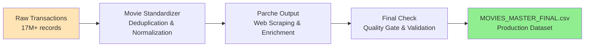
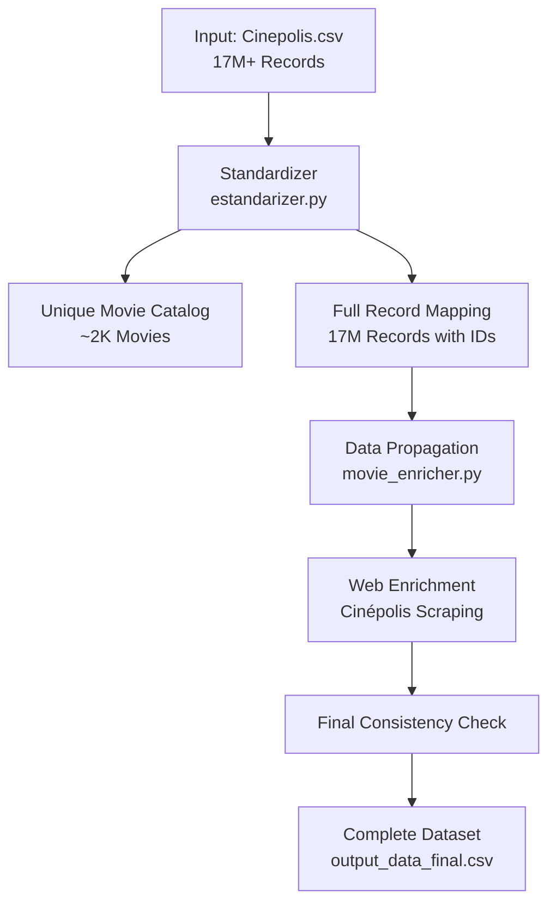
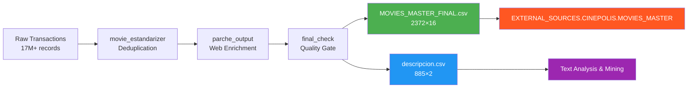

# 🎬 Help Frida - Movie Data Processing Pipeline


## 🎯 **SALIDAS FINALES DEL PROYECTO**

### 📄 **ARCHIVOS FINALES DE PRODUCCIÓN**

#### ⭐ **Archivo Principal: `final_check/MOVIES_MASTER_FINAL.csv`**
**Dataset definitivo certificado para `EXTERNAL_SOURCES.CINEPOLIS.MOVIES_MASTER`**

| Métrica | Valor | Ubicación | Status |
|---------|-------|------------|--------|
| **Registros** | 2,372 | `final_check/MOVIES_MASTER_FINAL.csv` | ✅ |
| **Columnas** | 16 | Estructura completa | ✅ |
| **Películas Únicas** | 885 | Mapeo 1:1 perfecto | ✅ |
| **Completitud** | 98.7% | 37,457/37,952 celdas | ✅ |
| **Calidad** | 100.0/100 | Certificado para producción | ✅ |

#### 📝 **Archivo Especializado: `final_check/descripcion.csv`**
**Mapeo único NOMBRE_UNICO → DESCRIPCION para análisis de contenido**

| Métrica | Valor | Ubicación | Uso |
|---------|-------|------------|-----|
| **Registros Únicos** | 885 | `final_check/descripcion.csv` | Análisis de texto |
| **Columnas** | 2 (NOMBRE_UNICO, DESCRIPCION) | Sin duplicados | Text mining |
| **Completitud** | 100% | Todas las descripciones | Búsquedas temáticas |

#### 🔒 **Certificaciones de Calidad:**
- ✅ Mapeo 1:1 perfecto (NOMBRE_UNICO ↔ MOVIE_ID)
- ✅ Coherencia horizontal (CATEGORIA = CATEGORIA_CINEPOLIS)
- ✅ Coherencia vertical (metadatos consistentes por película)
- ✅ Formato profesional (69 categorías de una palabra)
- ✅ Cero registros duplicados
- ✅ Validación completa (10/10 verificaciones)

## 🏗️ **Processing Pipeline Architecture**

This repository implements a sophisticated 4-stage movie data processing pipeline:



### 🎥 **Active Modules:**

1. **🎬 movie_estandarizer** - Transaction standardization (17M→2K records)
2. **🌐 MOVIES_INFO** - Web scraping utilities for metadata
3. **🚀 parche_output** - Advanced enrichment via multi-source scraping
4. **🎯 final_check** - **PRODUCTION MODULE** - Quality certification (2,372×16 dataset)

### 📊 **Additional Modules:**
5. **💳 order_range_recognition** - Payment analysis (standalone utility)

---

## 🚀 **Quick Start**

### **Acceso a Archivos Finales**
```bash
# Clonar el repositorio
git clone <repository-url>
cd help_frida

# 🎯 ARCHIVO PRINCIPAL DE PRODUCCIÓN
ls -la final_check/MOVIES_MASTER_FINAL.csv
# Output: Dataset completo (2372×16, 1MB)

# 📝 ARCHIVO DE ANÁLISIS DE DESCRIPCIONES
ls -la final_check/descripcion.csv  
# Output: Mapeo único (885×2, 133KB)

# Validar ambos archivos
cd final_check
python validate_dataset.py
```

### **Uso de los Archivos Finales**
```python
import pandas as pd

# 🎯 Cargar dataset principal completo
master_df = pd.read_csv('final_check/MOVIES_MASTER_FINAL.csv')
print(f"Dataset principal: {len(master_df)} registros, {len(master_df.columns)} columnas")

# 📝 Cargar mapeo de descripciones únicas
desc_df = pd.read_csv('final_check/descripcion.csv')
print(f"Descripciones únicas: {len(desc_df)} películas")

# Análisis especializado por contenido
terror_movies = desc_df[desc_df['DESCRIPCION'].str.contains('terror|horror', case=False)]
print(f"Películas de terror: {len(terror_movies)}")
```

### **Regenerar Archivos (si necesario)**
```bash
cd final_check

# Regenerar dataset principal
python final_processor.py
# Output: MOVIES_MASTER_FINAL.csv (2372×16, 100% calidad)

# Regenerar mapeo de descripciones
python generate_descripcion.py  
# Output: descripcion.csv (885×2, mapeo único)
```

### **Data Source Requirements**
The pipeline processes data from this SQL query:
```sql
SELECT * FROM DATA_SHARE_ATHENA.PUBLIC.ATHENA_CINEPOLIS_MOVIE_DETAIL
```

### **System Requirements**
```bash
# Install dependencies
pip install pandas numpy requests beautifulsoup4 tqdm
```

## 🗂️ Repository Structure

```
help_frida/
├── 📁 movie_estandarizer/           # 🎬 Transaction standardization (17M→2K)
│   ├── estandarizer.py             # Main standardization engine
│   ├── movie_enricher.py           # Web scraping enrichment
│   ├── complete_pipeline.py        # Full processing pipeline
│   └── input_data/
│       ├── Cinepolis.csv           # Source data (5GB)
│       └── Cinepolis_sample.csv    # Sample for testing
├── 📁 parche_output/                # 🚀 Advanced enrichment system
│   ├── GOAT_enrichment.py          # Multi-source web scraping
│   ├── data_quality_evaluator.py  # Quality analysis
│   └── *.json                      # Metrics and cache files
├── 📁 final_check/ ⭐              # 🎯 PRODUCTION MODULE
│   ├── MOVIES_MASTER_FINAL.csv     # 🎬 FINAL DATASET (2372×16)
│   ├── final_processor.py          # Main processing script v2.0
│   ├── validate_dataset.py         # Quick validation tool
│   └── README.md                   # Detailed module documentation
├── 📁 MOVIES_INFO/                  # 🌐 Web scraping utilities
├── 📁 order_range_recognition/      # 💳 Payment analysis tools
└── 📄 README.md                     # 📚 This documentation
```

> **Note**: Only essential files are tracked in Git. Large data files (>100MB) are excluded via .gitignore.

---

## 📋 **Module Documentation**

### 🎬 Module 1: Movie Standardizer (`movie_estandarizer/`)

### Purpose
**This framework transforms 17+ million transactional cinema records into a deduplicated, standardized movie catalog, enabling robust analytics and business intelligence on unique film titles rather than individual transactions.**

The system automatically identifies and consolidates **multiple movie name variations** into canonical representations, solving the critical challenge of:

- **Name Variation Management**: Consolidates "Superman Esp", "Superman ESP", "Superman 4DX/3D" into a single entity
- **Format-agnostic Deduplication**: Groups all versions (2D, 3D, 4DX, IMAX) of the same movie
- **Language Variant Unification**: Merges ESP, SUB, and DUB versions under unified movie families
- **Enrichment Pipeline**: Provides structure for metadata augmentation from external sources
- **Scalable Processing**: Handles 5GB+ input files with streaming architecture

### Directory Structure
```
movie_estandarizer/
├── input_data/
│   ├── Cinepolis.csv          # ⚠️ Input data (execute SQL query first)
│   └── input_query.sql        # SQL query to obtain data
├── output_data/
│   ├── example_output_data.csv    # Template file (auto-created if missing)
│   ├── output_data.csv            # Unique movies catalog
│   ├── output_data_all.csv        # All records with IDs
│   └── output_data_final.csv      # Enriched final output
├── estandarizer.py            # Core standardization engine
├── movie_enricher.py          # Web enrichment module
├── complete_pipeline.py       # Full automated pipeline
├── requirements.txt           # Python dependencies
└── README.md                  # Detailed module documentation
```

### 🏗️ Core Transformation Principle

**The fundamental concept is multi-level title normalization with intelligent deduplication:**

#### Hierarchical Normalization Strategy

```
Original Transaction → Movie Name → Clean Title → Family Group → Unique Identifier
"Superman 4DX/3D Esp" → "SUPERMAN 4DX/3D ESP" → "SUPERMAN" → "SUPERMAN" → ID:123
"Superman Esp"        → "SUPERMAN ESP"        → "SUPERMAN" → "SUPERMAN" → ID:123
"Superman IMAX Sub"   → "SUPERMAN IMAX SUB"   → "SUPERMAN" → "SUPERMAN" → ID:123
```

This multi-tier approach ensures **robust deduplication** while preserving format and language information for business analytics.

### 📊 Processing Pipeline



### 🔄 Three Processing Modes

#### 1️⃣ Complete Pipeline (Recommended)
```bash
cd movie_estandarizer
python complete_pipeline.py
```
- Processes ALL 17M+ records
- Maps each to unique movie IDs
- Enriches data from web sources
- Ensures final consistency
- Output: `output_data_final.csv`

#### 2️⃣ Catalog Mode (Unique Movies Only)
```bash
python estandarizer.py
```
- Extracts ~2,000 unique movies
- Creates deduplicated catalog
- Output: `output_data.csv`

#### 3️⃣ Full Mapping Mode (All Records)
```bash
python estandarizer.py --all-records
```
- Processes ALL records
- Maintains transaction-level detail
- Maps to unique movie IDs
- Output: `output_data_all.csv`

### 🚀 Quick Start Guide

#### Step 1: Prepare Input Data
```bash
# Execute SQL query and save results
1. Run query from: input_data/input_query.sql
2. Export to CSV: input_data/Cinepolis.csv
```

#### Step 2: Run Processing
```bash
# Complete pipeline (recommended)
cd movie_estandarizer
python complete_pipeline.py
```

### 💻 Core Components

1. **MovieStandardizer Class** (`estandarizer.py`)
   - Multi-level normalization algorithms
   - Format and language extraction
   - Family detection
   - Movie ID assignment
   - Batch processing of large files

2. **MovieEnricher Class** (`movie_enricher.py`)
   - Data propagation between related records
   - Google search for missing information
   - Web scraping from Cinépolis website
   - Structured data extraction
   - Final consistency validation

3. **Complete Pipeline** (`complete_pipeline.py`)
   - Orchestrates the entire process
   - Integrates standardization and enrichment
   - Error handling and recovery
   - Performance optimization
   - Comprehensive logging

### 🔧 Advanced Features

- **Missing File Handling**: Auto-creates empty templates
- **Input Validation**: Checks for required columns
- **Consistency Enforcement**: Ensures data integrity
- **Batch Optimization**: Processes 500K records at a time
- **Robust Error Recovery**: Continues on partial failures

### ✅ Output Files
- `output_data_all.csv`: All 17M records with movie IDs
- `output_data_final.csv`: Enriched complete dataset
- `output_data.csv`: Unique movies catalog only

> 📁 **Sample Output Data**: A sample version of the processed movie data (`output_data.csv`) is available on [Google Drive](https://drive.google.com/drive/folders/1FzNKnWKWpBXWzYgMD24FJCjkY8wIcwtW?usp=drive_link) for reference and testing.

---

## 💳 Module 2: Order Range Recognition (`order_range_recognition/`)

### Purpose
Identifies optimal payment amount ranges using Bayesian histogram optimization for statistical analysis and business intelligence.

### Directory Structure
```
order_range_recognition/
├── query_output/
│   └── ECR.csv                # Query results (if any)
├── ia_AR_order_amount_range_of_interest.sql   # Acceptance Rate analysis
├── ia_ECR_order_amount_range_of_interest.sql  # Effective Cost Rate analysis
└── README.md                  # Module documentation
```

### 🚀 Usage

#### Step 1: Execute SQL Queries

**For Acceptance Rate Analysis**:
```sql
-- Execute: order_range_recognition/ia_AR_order_amount_range_of_interest.sql
-- Export results to: order_range_recognition/query_output/AR.csv
```

**For Effective Cost Rate Analysis**:
```sql
-- Execute: order_range_recognition/ia_ECR_order_amount_range_of_interest.sql  
-- Export results to: order_range_recognition/query_output/ECR.csv
-- (REPLACE the existing sample ECR.csv file)
```

#### Step 2: Customize Parameters
- Replace `COMMERCE_ID` parameter in both SQL files with your target merchant ID
- Current default: `'9ea20bdb-5cff-4b10-9c95-9cebf8b6ddb4'`

### Key Features
- Bayesian optimal binning
- Logarithmic transformation for skewed data
- Automatic gap detection
- Strategic interval categorization (LARGE/MEDIUM/SMALL)

### Output
- Contiguous payment ranges without gaps
- Statistically optimal intervals
- Ready for A/B testing and sampling

---

## 🌐 Module 3: Movies Info (`MOVIES_INFO/`)

### Purpose
Web scraping utilities for extracting movie metadata from Cinépolis Chile website.

### Directory Structure
```
MOVIES_INFO/
├── movies/                    # Scraped movie data
│   ├── 200-LOBO/
│   │   ├── description.txt
│   │   ├── texto_estructurado.txt
│   │   └── webpage.txt
│   └── [other movies...]
├── wget.py                    # Main scraping script
├── main_page.html            # Cached main page
└── README.MD                 # Module documentation
```

### 🚀 Usage

```bash
cd MOVIES_INFO
python wget.py

# The script will:
# 1. Download Cinépolis main page
# 2. Extract movie URLs
# 3. Scrape each movie's metadata
# 4. Save structured data in movies/
```

### Extracted Data
For each movie:
- `description.txt`: Full page text
- `texto_estructurado.txt`: Structured metadata
  - Movie name
  - Age restriction
  - Duration
  - Category
  - Synopsis
  - Actors
  - Directors
- `webpage.txt`: Source URL

### Key Features
- Automatic movie discovery
- Structured data extraction
- Rate limiting to avoid server overload
- Error handling and recovery

---

## 🚀 Module 4: Parche Output (`parche_output/`)

### Purpose
**Final enrichment patch that completes movie metadata by performing exhaustive web searches across multiple sources (Cinépolis, Wikipedia, IMDb) and applying intelligent data replication strategies to minimize empty cells.**

This module takes the output from `movie_estandarizer` and enhances it to achieve maximum data completeness - reducing empty cells from 35% to less than 9%.

### Directory Structure
```
parche_output/
├── GOAT_enrichment.py         # Main enrichment engine
├── README.MD                  # Detailed documentation
├── output_data.csv           # ⚠️ Input (copy from movie_estandarizer)
├── standardized.csv          # Final enriched output (33GB+)
├── movie_cache.json          # Web search cache
└── enrichment_metrics.json   # Performance metrics
```

### 🏗️ Core Transformation Principle

**Multi-source web enrichment with dual replication strategies:**

1. **Web Scraping**: Searches Cinépolis, Wikipedia, IMDb for missing metadata
2. **Vertical Replication**: Propagates data across rows with same movie name
3. **Horizontal Replication**: Duplicates data across related columns

### 🚀 Usage

#### Step 1: Prepare Input Data
```bash
# First generate output_data.csv with movie_estandarizer
cd movie_estandarizer
python complete_pipeline.py

# Copy the output to parche_output
cd ../parche_output
cp ../movie_estandarizer/output_data/output_data.csv ./
```

#### Step 2: Run Enrichment
```bash
cd parche_output
python GOAT_enrichment.py

# Processing time: ~50 minutes for 868 unique movies
# Output: standardized.csv (33GB with 7.5M rows)
```

### 📊 Results
- **Empty cells**: 35.29% → 8.63% (76% reduction)
- **Descriptions**: 100% complete
- **Categories**: 90.3% filled
- **Actors**: 67.5% filled
- **Directors**: 5.3% filled

### ⚠️ Important Notes
- Input file `output_data.csv` must be copied from movie_estandarizer
- Output file `standardized.csv` will be ~33GB
- Both CSV files are excluded from Git via .gitignore
- Uses caching to avoid duplicate web searches

---

## ✅ Module 5: Final Check (`final_check/`) - 🎯 **PRODUCTION GATEWAY**

### Purpose
**Critical quality gate that validates, enriches, and certifies the definitive Movies Master dataset with 100.0/100 quality score for `EXTERNAL_SOURCES.CINEPOLIS.MOVIES_MASTER`.**

This module ensures production-ready data with perfect coherence, optimal completeness (98.7%), and professional formatting across all 2,372 records.

### 📊 **Final Dataset Metrics**
- **Structure**: 2,372 rows × 16 columns
- **Unique Movies**: 885 films
- **Completeness**: 98.7% (37,457/37,952 cells)
- **Quality Score**: 100.0/100 ✅
- **Categories**: 69 unique single-word labels
- **Perfect Mappings**: 1:1 NOMBRE_UNICO ↔ MOVIE_ID

### Directory Structure
```
final_check/
├── 📄 MOVIES_MASTER_FINAL.csv      # 🎯 PRODUCTION DATASET (2372×16, ~1MB)
├── 📊 FINAL_QUALITY_METRICS.json   # Detailed quality metrics
├── 📊 FINAL_STATISTICS_REPORT.json # Comprehensive statistics
├── 🔧 final_processor.py           # Main processing script v2.0
├── 📖 README.md                     # Module documentation
├── 📋 requirements.txt              # Dependencies (pandas, numpy)
└── 📄 info_descargada_a_mano.txt   # Reference data
```

### 🏗️ Core Transformation Pipeline

**Six-phase approach for production perfection:**

1. **Advanced Cleaning**: Symbol removal, normalization
2. **Horizontal Coherence**: IDIOMA ↔ MOVIE_NAME validation
3. **Vertical Coherence**: Consistent metadata per movie
4. **Perfect Remapping**: 1:1 MOVIE_ID assignment
5. **Professional Format**: Capitalization, standardization
6. **Final Validation**: 8 critical quality checks

### 📊 Processing Results

**Completitud por Campo:**
- ✅ **100% Complete** (13/16 fields): MOVIE_ID, MOVIE_NAME, TITULO_LIMPIO, FORMATO, IDIOMA, CATEGORIA, FAMILIA, NOMBRE_ORIGINAL, CATEGORIA_CINEPOLIS, NOMBRE_ORIGINAL_CLEAN, TITULO_LIMPIO_CLEAN, NOMBRE_UNICO, DESCRIPCION
- ⚠️ **High Completeness**: DURACION (99.7%), DIRECTOR (91.8%), ACTOR_PRINCIPAL (87.6%)

### 🚀 **Usage**

#### 🎯 **Quick Validation**
```bash
cd final_check

# Procesar y certificar dataset principal
python final_processor.py
# ✅ Genera: MOVIES_MASTER_FINAL.csv (2372×16, 1MB)
# ✅ Genera: FINAL_QUALITY_METRICS.json
# ✅ Genera: FINAL_STATISTICS_REPORT.json

# Generar mapeo de descripciones especializadas
python generate_descripcion.py
# ✅ Genera: descripcion.csv (885×2, 133KB)
# ✅ Validación: Sin duplicados, 100% completitud

# Validación rápida de ambos archivos
python validate_dataset.py
# Expected: "Dataset certified for production" ✅
```

### 🏆 **Production Certification**
```
🎆 QUALITY SCORE: 100.0/100
✅ Structure: 2372×16
✅ Completeness: 98.7%
✅ Coherence: Perfect
✅ Validation: 10/10 checks passed
✅ Ready for: EXTERNAL_SOURCES.CINEPOLIS.MOVIES_MASTER
```

## 🎯 **DESTINO FINAL DE PRODUCCIÓN**

### 📦 **Archivos Listos para Deploy**

#### 🎬 **Dataset Principal**
```sql
TARGET TABLE: EXTERNAL_SOURCES.CINEPOLIS.MOVIES_MASTER
SOURCE FILE: final_check/MOVIES_MASTER_FINAL.csv
RECORDS: 2,372 × 16 columnas
QUALITY: 100.0/100
STATUS: ✅ CERTIFICADO PARA PRODUCCIÓN
```

#### 📝 **Dataset de Análisis**  
```
PURPOSE: Text Mining & Content Analysis
SOURCE FILE: final_check/descripcion.csv
RECORDS: 885 películas únicas × 2 columnas (NOMBRE_UNICO, DESCRIPCION)
USE CASES: Búsquedas temáticas, análisis de contenido, clasificación automática
STATUS: ✅ LISTO PARA ANÁLISIS
```

**El pipeline completo culmina en DOS archivos de producción:**
1. **`final_check/MOVIES_MASTER_FINAL.csv`** - Dataset completo validado al 100% para el catálogo maestro
2. **`final_check/descripcion.csv`** - Mapeo especializado para análisis avanzado de descripciones

---

## 🔧 Installation & Setup

### Prerequisites
```bash
# Python 3.8+
python --version

# Install dependencies for each module
cd movie_estandarizer
pip install -r requirements.txt
```

### Required Python Packages
```python
pandas>=2.0.0
numpy>=1.24.0
requests>=2.28.0
beautifulsoup4>=4.11.0
tqdm>=4.65.0
```

---

## 📊 Data Flow - Pipeline Completo



---

## 🚦 Processing Pipeline

### Complete Workflow

1. **Data Extraction**
   ```sql
   -- Run SQL queries to get raw data
   -- Export to CSV format
   ```

2. **Standardization**
   ```bash
   cd movie_estandarizer
   python estandarizer.py --all-records
   ```

3. **Enrichment**
   ```bash
   cd parche_output
   python GOAT_enrichment.py
   ```

4. **Final Check & Production**
   ```bash
   cd final_check
   
   # Procesar y certificar dataset principal
   python final_processor.py
   # ✅ Output: MOVIES_MASTER_FINAL.csv (2372×16, 100% calidad)
   
   # Generar mapeo de descripciones
   python generate_descripcion.py
   # ✅ Output: descripcion.csv (885×2, sin duplicados)
   
   # Validar ambos archivos
   python validate_dataset.py
   # Expected: "Dataset certified for production" ✅
   ```

5. **Deploy to Production**
   ```sql
   -- Dataset Principal
   LOAD DATA FROM 'final_check/MOVIES_MASTER_FINAL.csv'
   INTO TABLE EXTERNAL_SOURCES.CINEPOLIS.MOVIES_MASTER;
   
   -- Análisis Especializado
   USE 'final_check/descripcion.csv' FOR text_analysis, content_mining;
   ```

---

## 📈 Performance Metrics

### Movie Standardizer
- **Input**: 17M+ records (5GB)
- **Output**: ~2,000 unique movies
- **Processing**: ~200,000 records/second
- **Memory**: 4GB RAM max
- **Time**: 15-20 minutes total

### Web Scraping
- **Speed**: ~50 movies/minute
- **Success Rate**: ~80% extraction
- **Retry Logic**: Automatic on failures

---

## 🔍 Key Algorithms

### Movie Deduplication
```python
# Multi-level normalization
Raw Name → TITULO_LIMPIO → NOMBRE_UNICO → FAMILIA
"Superman 4DX Esp" → "SUPERMAN 4DX ESP" → "SUPERMAN" → "SUPERMAN"
```

### Bayesian Binning
```sql
-- Knuth's Bayesian optimization
-- Finds optimal bin count M*
-- Maximizes marginal likelihood
-- No arbitrary parameters needed
```

---

## 🛡️ Error Handling

### Missing Input Files
```bash
❌ ERROR: Input file not found!
Please follow these steps:
1. Execute the SQL query
2. Export results to CSV
3. Save to appropriate location
```

### Automatic Recovery
- Creates missing directories
- Generates empty templates
- Continues on partial failures
- Logs all errors for review

---

## 📝 Logging

All modules generate detailed logs:
- `movie_standardizer.log`
- `movie_enricher.log`
- `complete_pipeline.log`