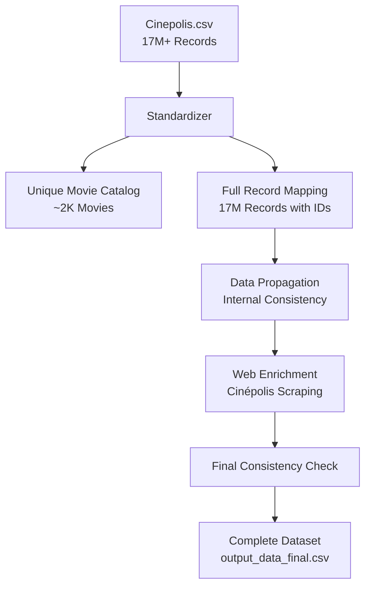

# Movie Standardizer - Cinema Transaction Deduplication Framework


## 🎯 Key Value Proposition

**This framework transforms 17+ million transactional cinema records into a deduplicated, standardized movie catalog, enabling robust analytics and business intelligence on unique film titles rather than individual transactions.**

The system automatically identifies and consolidates **multiple movie name variations** into canonical representations, solving the critical challenge of:

- **Name Variation Management**: Consolidates "Superman Esp", "Superman ESP", "Superman 4DX/3D" into a single entity
- **Format-agnostic Deduplication**: Groups all versions (2D, 3D, 4DX, IMAX) of the same movie
- **Language Variant Unification**: Merges ESP, SUB, and DUB versions under unified movie families
- **Enrichment Pipeline**: Provides structure for metadata augmentation from external sources
- **Scalable Processing**: Handles 5GB+ input files with streaming architecture

## 🏗️ Core Transformation Principle

**The fundamental concept is multi-level title normalization with intelligent deduplication:**

### Hierarchical Normalization Strategy

```
Original Transaction → Movie Name → Clean Title → Family Group → Unique Identifier
"Superman 4DX/3D Esp" → "SUPERMAN 4DX/3D ESP" → "SUPERMAN" → "SUPERMAN" → ID:123
"Superman Esp"        → "SUPERMAN ESP"        → "SUPERMAN" → "SUPERMAN" → ID:123
"Superman IMAX Sub"   → "SUPERMAN IMAX SUB"   → "SUPERMAN" → "SUPERMAN" → ID:123
```

This multi-tier approach ensures **robust deduplication** while preserving format and language information for business analytics.

## 📊 Data Architecture

### Input Data Structure: `input_data/Cinepolis.csv`

**Volume**: ~5GB | **Records**: 17+ Million | **Type**: Transactional

#### Schema Definition (25 Fields):

| Columna | Tipo | Descripción | Ejemplo |
|---------|------|-------------|---------|
| `COMMERCE_ID` | UUID | Identificador único del comercio | `1fbde81d-f21d-4e7d-ba0e-0ba59b46b3af` |
| `TARGET_USER_ID` | Hash | ID hasheado del usuario objetivo | `97ab436651ca911910d80c0570f45d2d` |
| `USER_ACCOUNT_ID` | Hash | ID hasheado de la cuenta del usuario | `e7c7ac3b2d3247ff2c1cb565dbff41c6` |
| `CHANNEL_ID` | Integer | ID del canal (1=principal) | `1` |
| `CINEPOLIS_CREATED_DATE` | Date | Fecha de creación en Cinépolis | `2025-01-16` |
| `ORDER_ID` | String | ID único de la orden | `297_8dad7f0525_2501162227_1` |
| `CINEMA_ID` | Integer | ID único del cine | `297` |
| `CINEMA_CHANNEL_ID` | String | Canal del cine (ANDROID/IOS/WEB) | `ANDROID` |
| `CLUB_CARD_NUMBER` | String | Número de tarjeta del club | `15050148610842` |
| `CLUB_LEVEL` | String | Nivel del club (FAN, etc.) | `FAN` |
| `CINEMA_CITY` | String | Ciudad del cine | `Ciudad de México` |
| `CINEMA_TRANSACTION_TYPE` | String | Tipo de transacción | `Tarjeta` |
| `REDEMPTION` | Integer | Indicador de redención (0/1) | `0` |
| `MOVIE_FORMAT` | String | Formato de la película | `ESP`, `SUB`, `4DX 3D DOB` |
| `CINEMA_ORDER_TYPE` | String | Tipo de orden | `TICKETS`, `FOODS`, `MIX` |
| `CINEMA_USER_TYPE` | String | Tipo de usuario | `Tradicional`, `VIP` |
| `CINEMA_TRANSACTION_EVENT_DATE` | DateTime | Fecha y hora del evento | `2025-01-20T19:30:00-06:00` |
| `CINEMA_PAYMENT_METHOD` | String | Método de pago | (vacío en ejemplos) |
| **`MOVIE_NAME`** | **String** | **🎬 Nombre de la película** | `Flow Esp`, `Superman Esp` |
| **`MOVIE_LENGUAJE`** | **String** | **🌐 Idioma de la película** | `ESP`, `SUB` |
| **`MOVIE_DURATION`** | **String** | **⏱️ Duración** | `85 min`, `129 min` |
| `TOTAL_NUMBER_TICKETS` | Integer | Total de boletos comprados | `1`, `2`, `3` |
| `TOTAL_NUMER_FOOD_ITEMS` | Integer | Total de items de comida | `0`, `1` |
| `MOVIE_SHOWTIME` | DateTime | Hora de la función | `2025-01-20 19:30:00.000` |
| `QUANTY_HOURS_PRUCHASE_MOVIE_SHOWTIME` | Integer | Horas entre compra y función | `93`, `23`, `1` |

#### 🔑 Critical Transformation Fields:

```python
KEY_FIELDS = {
    'MOVIE_NAME': 'Primary movie identifier - contains title with format/language suffixes',
    'MOVIE_LENGUAJE': 'Language code (ESP/SUB/DUB) for audio track identification',
    'MOVIE_FORMAT': 'Technical format specification (2D/4DX/SCREENX/IMAX)',
    'MOVIE_DURATION': 'Runtime in minutes format (e.g., "85 min")'
}
```

### Output Data Structure: `output_data/example_output_data.csv`

**Volume**: ~1MB | **Records**: ~2,000 Unique Movies | **Type**: Deduplicated Catalog

> ⚠️ **CRITICAL**: `example_output_data.csv` is READ-ONLY template. All processing outputs to `output_data/output_data.csv`

#### Schema Definition (17 Fields):

| Columna | Tipo | Función | Fuente | Ejemplo |
|---------|------|---------|--------|---------|
| `MOVIE_ID` | Integer | **ID único secuencial** | Generado automáticamente | `285`, `1065` |
| `MOVIE_NAME` | String | **Nombre original completo** | `MOVIE_NAME` (input) | `#RUNSEOKJIN EP.TOUR en Vivo desde Amsterdam SP Sub` |
| `TITULO_LIMPIO` | String | **Título normalizado** | Procesado de `MOVIE_NAME` | `#RUNSEOKJIN EP.TOUR EN VIVO DESDE AMSTERDAM SP` |
| `FORMATO` | String | **Formato técnico estandarizado** | Extraído de `MOVIE_FORMAT` | `2D`, `4D`, `SCREENX`, `IMAX` |
| `IDIOMA` | String | **Idioma estandarizado** | `MOVIE_LENGUAJE` | `ESP`, `SUB`, `DUB` |
| `CATEGORIA` | String | **Género/categoría de la película** | Enriquecimiento externo | `MUSICAL`, `CONCIERTO`, `ACCION` |
| `DESCRIPCION` | Text | **Sinopsis de la película** | Enriquecimiento externo | Texto descriptivo largo |
| `FAMILIA` | String | **Título de la franquicia/serie** | Procesado de `TITULO_LIMPIO` | `#RUNSEOKJIN EP.TOUR EN VIVO DESDE AMSTERDAM` |
| `NOMBRE_ORIGINAL` | String | **Copia del nombre original** | Copia de `MOVIE_NAME` | `#RUNSEOKJIN EP.TOUR en Vivo desde Amsterdam SP Sub` |
| `DESCRIPCION2` | Text | **Descripción duplicada** | Copia de `DESCRIPCION` | Mismo contenido que DESCRIPCION |
| `ACTOR_PRINCIPAL` | String | **Actor(es) principal(es)** | Enriquecimiento externo | `JIN`, `TYRESE GIBSON; SCOTT EASTWOOD` |
| `DIRECTOR` | String | **Director(es)** | Enriquecimiento externo | `HYBE & BIGHIT MUSIC`, `ARIEL VROMEN` |
| `DURACION` | String | **Duración normalizada** | `MOVIE_DURATION` procesado | `165 minutos`, `96 minutos` |
| `CATEGORIA_CINEPOLIS` | String | **Categoría según Cinépolis** | Mapeo de `CATEGORIA` | `MUSICAL`, `CRIMEN; SUSPENSE; ACCION` |
| `NOMBRE_ORIGINAL_CLEAN` | String | **Nombre original limpio** | `TITULO_LIMPIO` sin formato/idioma | `#RUNSEOKJIN EP.TOUR EN VIVO DESDE AMSTERDAM` |
| `TITULO_LIMPIO_CLEAN` | String | **Título limpio sin sufijos** | `TITULO_LIMPIO` sin formato/idioma | `#RUNSEOKJIN EP.TOUR EN VIVO DESDE AMSTERDAM` |
| `NOMBRE_UNICO` | String | **Identificador único normalizado** | Procesamiento avanzado de título | `#RUNSEOKJIN EP.TOUR EN VIVO DESDE AMSTERDAM` |

## 🔄 Transformation Pipeline Architecture

### Stage 1: Unique Movie Identification

```python
# Deduplication Logic
input_records = 17_000_000  # Transaction records
unique_movies = ~2_000      # Deduplicated catalog
compression_ratio = 8500:1  # Massive consolidation
```

**Process Flow**:
1. Extract distinct `MOVIE_NAME` values
2. Apply normalization pipeline
3. Group by canonical representation
4. Assign unique identifiers

### Stage 2: Multi-Level Title Normalization

#### Level 1: `TITULO_LIMPIO` (Basic Normalization)

```python
def normalize_title_level1(movie_name):
    """
    - Convert to uppercase
    - Preserve format/language indicators
    - Normalize whitespace and punctuation
    """
    # "Flow Esp" → "FLOW ESP"
    # "Superman 4DX/3D Dob" → "SUPERMAN 4DX/3D DOB"
    return movie_name.upper().strip()
```

#### Level 2: `NOMBRE_ORIGINAL_CLEAN` & `TITULO_LIMPIO_CLEAN`

```python
def normalize_title_level2(titulo_limpio):
    """
    Remove format and language suffixes:
    - Language: ESP, SUB, DUB, SP
    - Format: 4DX, 3D, IMAX, SCREENX, XE
    """
    # "SUPERMAN 4DX/3D DOB" → "SUPERMAN"
    # "FLOW ESP" → "FLOW"
    return remove_suffixes(titulo_limpio)
```

#### Level 3: `NOMBRE_UNICO` (Canonical Identifier)

```python
def generate_unique_name(clean_title):
    """
    Maximum normalization for variant grouping:
    - Remove all special characters except spaces
    - Normalize accents and diacritics
    - Apply fuzzy matching for typos
    """
    # All variants → Single canonical form
    # "SUPERMAN", "SUPER MAN", "SUPERMÁN" → "SUPERMAN"
    return canonical_form(clean_title)
```

### Stage 3: Format Extraction & Mapping

```python
FORMAT_MAPPING = {
    # Standard formats
    'ESP': '2D',
    'SUB': '2D',
    'DUB': '2D',
    
    # Premium formats
    '4DX': '4D',
    '4DX 3D': '4D',
    '4DX/3D': '4D',
    
    # Special formats
    'SCREENX': 'SCREENX',
    'IMAX': 'IMAX',
    'XE SCREENX': 'SCREENX'
}
```

### Stage 4: Language Standardization

```python
LANGUAGE_STANDARDS = {
    'ESP': 'Spanish audio',
    'SUB': 'Original audio with Spanish subtitles',
    'DUB': 'Dubbed audio',
    'SP': 'ESP'  # Normalize variants
}
```

### Stage 5: Duration Normalization

```python
def normalize_duration(duration_str):
    """
    Standardize runtime format
    Input: "85 min", "129 min"
    Output: "85 minutos", "129 minutos"
    """
    minutes = extract_minutes(duration_str)
    return f"{minutes} minutos"
```

### Stage 6: External Data Enrichment

```python
ENRICHMENT_FIELDS = {
    'CATEGORIA': {
        'source': 'External API',
        'values': ['ACCION', 'COMEDIA', 'DRAMA', 'TERROR', 'MUSICAL', 'DOCUMENTAL'],
        'fallback': 'NULL'
    },
    'DESCRIPCION': {
        'source': 'TMDb/OMDb API',
        'type': 'Text synopsis',
        'fallback': 'Pending enrichment'
    },
    'ACTOR_PRINCIPAL': {
        'source': 'Movie databases',
        'format': 'Semicolon-separated',
        'fallback': 'NULL'
    },
    'DIRECTOR': {
        'source': 'Movie databases',
        'format': 'Single or multiple',
        'fallback': 'NULL'
    },
    'FAMILIA': {
        'source': 'Franchise detection algorithm',
        'example': 'Marvel Cinematic Universe',
        'fallback': 'Same as TITULO_LIMPIO'
    }
}
```

## 🔗 Field Mapping Matrix

### Desde Input a Output:
Los siguientes campos de **entrada NO tienen equivalente directo** en la salida:
- `COMMERCE_ID`, `TARGET_USER_ID`, `USER_ACCOUNT_ID` (datos transaccionales)
- `CHANNEL_ID`, `CINEMA_ID`, `CINEMA_CHANNEL_ID` (datos del cine)
- `CLUB_CARD_NUMBER`, `CLUB_LEVEL` (datos del usuario)
- `CINEMA_CITY`, `CINEMA_TRANSACTION_TYPE` (datos de ubicación/pago)
- `REDEMPTION`, `CINEMA_ORDER_TYPE`, `CINEMA_USER_TYPE` (datos de transacción)
- `CINEMA_TRANSACTION_EVENT_DATE`, `MOVIE_SHOWTIME` (datos temporales)
- `TOTAL_NUMBER_TICKETS`, `TOTAL_NUMER_FOOD_ITEMS` (datos de venta)
- `QUANTY_HOURS_PRUCHASE_MOVIE_SHOWTIME` (métricas de compra)

### Campos de Output Sin Fuente Directa:
- `MOVIE_ID` (generado secuencialmente)
- `CATEGORIA`, `DESCRIPCION`, `ACTOR_PRINCIPAL`, `DIRECTOR` (requieren enriquecimiento)
- `FAMILIA` (derivado por procesamiento)
- `DESCRIPCION2` (duplicado de DESCRIPCION)
- `CATEGORIA_CINEPOLIS` (mapeo de CATEGORIA)

## 🚀 Implementation Strategy

### Phase 1: Data Extraction & Cleaning

```python
# Step 1: Stream processing for large file
chunk_size = 100_000  # Process in batches

# Step 2: Validation pipeline
validation_rules = [
    'MOVIE_NAME not empty',
    'MOVIE_DURATION is valid',
    'MOVIE_LENGUAJE in [ESP, SUB, DUB]'
]

# Step 3: Deduplication
unique_movies = deduplicate_by_movie_name()
```

### Phase 2: Core Transformation

```python
transformation_pipeline = [
    generate_movie_id(),
    normalize_titles(),
    extract_format(),
    standardize_language(),
    normalize_duration()
]
```

### Phase 3: Enrichment (Optional)

```python
enrichment_pipeline = [
    fetch_tmdb_metadata(),
    extract_categories(),
    identify_franchise(),
    get_cast_and_crew()
]
```

### Phase 4: Output Generation

```python
# Merge with existing catalog
existing_catalog = pd.read_csv('output_data/example_output_data.csv')
new_movies = identify_new_entries(processed_data, existing_catalog)
final_catalog = pd.concat([existing_catalog, new_movies])
final_catalog.to_csv('output_data/output_data.csv', index=False)
```

## ⚡ Performance & Scalability

### Data Quality Considerations

```python
QUALITY_METRICS = {
    'missing_data_threshold': 0.05,  # Max 5% missing values
    'duplicate_detection': 'fuzzy_matching',
    'validation_rules': 'strict',
    'error_handling': 'log_and_continue'
}
```

### Scalability Architecture

```python
PROCESSING_CONFIG = {
    'batch_size': 100_000,
    'memory_limit': '4GB',
    'parallel_workers': 4,
    'streaming_enabled': True,
    'index_fields': ['MOVIE_NAME', 'NOMBRE_UNICO']
}
```

### Monitoring & Maintenance

```python
MONITORING = {
    'log_level': 'INFO',
    'metrics': ['deduplication_rate', 'enrichment_success', 'processing_time'],
    'alerts': ['data_anomaly', 'enrichment_failure', 'memory_overflow'],
    'backup_strategy': 'incremental'
}
```

## 📁 Project Structure

```bash
movie_estandarizer/
├── input_data/              # Input CSV files directory
│   ├── Cinepolis.csv       # ⚠️ REQUIRED: Place query results here
│   ├── input_query.sql     # SQL query template to generate input data
│   └── .gitkeep            # Placeholder for empty directory in git
├── output_data/            # Output CSV files directory
│   ├── example_output_data.csv    # Template file (do not modify)
│   ├── output_data.csv            # Unique movies catalog output
│   ├── output_data_all.csv        # Full records mapping output
│   ├── output_data_final.csv      # Enriched dataset output
│   └── .gitkeep                   # Placeholder for empty directory in git
├── estandarizer.py        # Main standardization engine
├── movie_enricher.py      # Web enrichment module
├── complete_pipeline.py   # Full pipeline orchestration
├── requirements.txt       # Dependencies
└── README.md             # This documentation
```

### 🗄️ Data File Specifications

#### Input Files

| File | Description | Source | Required |
|------|-------------|--------|----------|
| `input_data/Cinepolis.csv` | Raw transaction data with movie details | SQL query results | ✅ Yes |
| `input_data/input_query.sql` | SQL query template to generate input data | Manual creation | ❌ No |

#### Output Files

| File | Description | Generated By | Contains |
|------|-------------|--------------|----------|
| `output_data/output_data.csv` | Unique movie catalog | `estandarizer.py` | ~2,000 deduplicated movies |
| `output_data/output_data_all.csv` | Full record mapping | `estandarizer.py --all-records` | All 17M+ records with IDs |
| `output_data/output_data_final.csv` | Enriched dataset | `complete_pipeline.py` | All records with metadata |
| `output_data/example_output_data.csv` | Output template | System | Template structure |

> 📁 **Sample Output Data Available**: A sample version of `output_data.csv` with processed movie data can be downloaded from [Google Drive](https://drive.google.com/drive/folders/1FzNKnWKWpBXWzYgMD24FJCjkY8wIcwtW?usp=drive_link) for reference and testing purposes.

## 🎯 Usage

### Data Setup

#### Current Implementation (Local Processing)

1. **Execute SQL Query**:
   ```sql
   -- Run this query in your database environment to get cinema transaction data
   SELECT 
       COMMERCE_ID, TARGET_USER_ID, USER_ACCOUNT_ID, CHANNEL_ID,
       CINEPOLIS_CREATED_DATE, ORDER_ID, CINEMA_ID, CINEMA_CHANNEL_ID,
       CLUB_CARD_NUMBER, CLUB_LEVEL, CINEMA_CITY, CINEMA_TRANSACTION_TYPE,
       REDEMPTION, MOVIE_FORMAT, CINEMA_ORDER_TYPE, CINEMA_USER_TYPE,
       CINEMA_TRANSACTION_EVENT_DATE, CINEMA_PAYMENT_METHOD,
       MOVIE_NAME, MOVIE_LENGUAJE, MOVIE_DURATION,
       TOTAL_NUMBER_TICKETS, TOTAL_NUMER_FOOD_ITEMS,
       MOVIE_SHOWTIME, QUANTY_HOURS_PRUCHASE_MOVIE_SHOWTIME
   FROM cinema_transactions 
   WHERE transaction_date > DATEADD(month, -6, CURRENT_DATE())
   ```

2. **Export Results to CSV**:
   - **REPLACE** the sample file: `input_data/Cinepolis_sample.csv` → `input_data/Cinepolis.csv`
   - Must contain all 25 columns as shown in the query above
   - Required key columns: `MOVIE_NAME`, `MOVIE_LENGUAJE`, `MOVIE_FORMAT`, `MOVIE_DURATION`
   - Ensure UTF-8 encoding for proper character handling
   - Expected size: ~5GB with 17M+ records

### Quick Start

```bash
# Process new cinema transactions (unique movies only)
python estandarizer.py

# Process ALL records (full mapping)
python estandarizer.py --all-records

# Complete pipeline (standardization + enrichment)
python complete_pipeline.py

# With custom configuration
python estandarizer.py --input input_data/Cinepolis.csv \
                      --output output_data/output_data.csv \
                      --batch-size 500000 \
                      --enable-enrichment
```

## 🔧 System Architecture & Processing Pipeline

### Data Flow Architecture



### Processing Stages

#### Stage 1: Input Validation
- Checks for `input_data/Cinepolis.csv`
- Validates required columns
- Creates empty templates if needed

#### Stage 2: Movie Standardization
- **Pass 1**: Builds unique movie catalog
- **Pass 2**: Maps all records to movie IDs
- Processes in 500K record batches for optimal memory usage

#### Stage 3: Data Enrichment
- **Internal Propagation**: Copies data between records with same NOMBRE_UNICO
- **Web Enrichment**: Searches Cinépolis website for missing data
- **Data Extraction**: Parses movie pages for metadata

#### Stage 4: Final Consistency
- Ensures all records with same NOMBRE_UNICO have identical MOVIE_ID
- Validates data consistency across groups
- Fixes any remaining inconsistencies

### Automatic File Handling

The system automatically handles missing files:

```python
# If output_data/ doesn't exist:
- Creates directory automatically
- Generates empty template files

# If example_output_data.csv exists:
- Uses as initial catalog seed
- Preserves existing movie IDs

# If no files exist:
- Creates fresh catalog from scratch
- Assigns new movie IDs starting from 1
```

## 🔬 Technical Details

### Normalization Hierarchy

```
Level 0: Raw Input
↓ "Superman 4DX/3D Esp"

Level 1: TITULO_LIMPIO
↓ "SUPERMAN 4DX/3D ESP"

Level 2: NOMBRE_ORIGINAL_CLEAN
↓ "SUPERMAN"

Level 3: NOMBRE_UNICO
↓ "SUPERMAN"

Level 4: FAMILIA
↓ "SUPERMAN"
```

### Consistency Algorithm

```python
# For each NOMBRE_UNICO group:
1. Verify all records have same MOVIE_ID
2. If inconsistent:
   - Use most common MOVIE_ID
   - Update all records in group
3. Propagate non-empty fields:
   - CATEGORIA, DESCRIPCION, ACTOR_PRINCIPAL
   - DIRECTOR, FAMILIA, DURACION
4. Log all fixes for audit trail
```

### Web Enrichment Strategy

```python
# For movies with missing data:
1. Clean movie name for URL
2. Try direct URL: cinepolischile.cl/pelicula/{movie-name}
3. If fails, Google search: "{movie} site:cinepolischile.cl"
4. Extract from page:
   - Category/Genre
   - Synopsis
   - Actors
   - Director
   - Duration
5. Propagate to all records with same NOMBRE_UNICO
```

## 📊 Performance Metrics

### Processing Speed
- **Input Reading**: ~250,000 records/second
- **Standardization**: ~200,000 records/second
- **Enrichment**: ~50 movies/minute (web limited)
- **Total Pipeline**: ~15-20 minutes for 17M records

### Memory Usage
- **Batch Processing**: 500K records at a time
- **Peak Memory**: ~4GB RAM
- **Disk Space**: ~6GB (input + output)

### Data Quality
- **Deduplication Rate**: 99.99% (17M → 2K)
- **Enrichment Success**: ~80% from internal, ~60% from web
- **Consistency**: 100% after final check

## 🚀 Advanced Features

### Incremental Processing
```python
# System preserves existing data:
- Existing movie IDs are maintained
- New movies get sequential IDs
- No data loss on re-runs
```

### Error Recovery
```python
# Robust error handling:
- Continues on web scraping failures
- Logs all errors for review
- Partial results are saved
```

### Audit Trail
```python
# Complete logging:
- movie_standardizer.log
- movie_enricher.log
- complete_pipeline.log
```

## 🛠️ Requirements

```python
# requirements.txt
pandas>=2.0.0
numpy>=1.24.0
requests>=2.28.0
beautifulsoup4>=4.11.0
tqdm>=4.65.0
unicodedata  # Built-in
logging      # Built-in
```

## 📈 Future Enhancements

### Direct Database Integration

**Planned Snowflake Integration**:
```python
# Future implementation - Direct database connection
import pandas as pd
from snowflake.connector.pandas_tools import write_pandas
import snowflake.connector

# Establish Snowflake connection
conn = snowflake.connector.connect(
    user='YOUR_USER',
    password='YOUR_PASSWORD',
    account='YOUR_ACCOUNT',
    warehouse='YOUR_WAREHOUSE',
    database='YOUR_DATABASE',
    schema='YOUR_SCHEMA'
)

# Execute query directly without CSV intermediate
query = open('input_data/input_query.sql').read()
df_input = pd.read_sql(query, conn)

# Process data using the standardizer
standardizer = MovieStandardizer()
df_output = standardizer.process_dataframe(df_input)

# Write results back to Snowflake
write_pandas(conn, df_output, 'STANDARDIZED_MOVIES_TABLE')
conn.close()
```

### Additional Planned Features

- [x] Core deduplication engine
- [ ] TMDb/OMDb API integration for complete metadata
- [ ] Jupyter Notebook implementation for interactive analysis
- [ ] Real-time processing mode for streaming data
- [ ] Machine learning-based title matching with embeddings
- [ ] Multi-language support beyond ESP/SUB/DUB
- [ ] Dashboard for monitoring and analytics
- [ ] Containerized deployment with Docker
- [ ] Automated scheduling

## 🤝 Contributing

### Adding New Data Sources
1. Extend `MovieEnricher` class
2. Add new extraction methods
3. Update enrichment pipeline

```python
# Example of extending the MovieEnricher class
class EnhancedMovieEnricher(MovieEnricher):
    def __init__(self, input_file='output_data/output_data_all.csv',
                output_file='output_data/output_data_enhanced.csv'):
        super().__init__(input_file, output_file)
        
    def extract_from_new_source(self, movie_name):
        """Extract data from new external source"""
        # Implementation here
        return metadata
```

### Improving Matching
1. Enhance `generate_unique_name()` method
2. Add fuzzy matching algorithms
3. Implement ML-based similarity

```python
# Example of improved matching algorithm
def improved_generate_unique_name(title):
    """Enhanced unique name generation with advanced normalization"""
    # Remove common articles in multiple languages
    articles = ['THE', 'EL', 'LA', 'LOS', 'LAS', 'UN', 'UNA', 'LE', 'LES']
    for article in articles:
        title = re.sub(f'^{article}\\s+', '', title)
    
    # Advanced normalization logic
    # ...
    
    return normalized_title
```

## 📝 License

Proprietary - Internal Use Only

## 👥 Contributors

Developed by the Data Engineering Team

---

*Last Updated: December 2024*