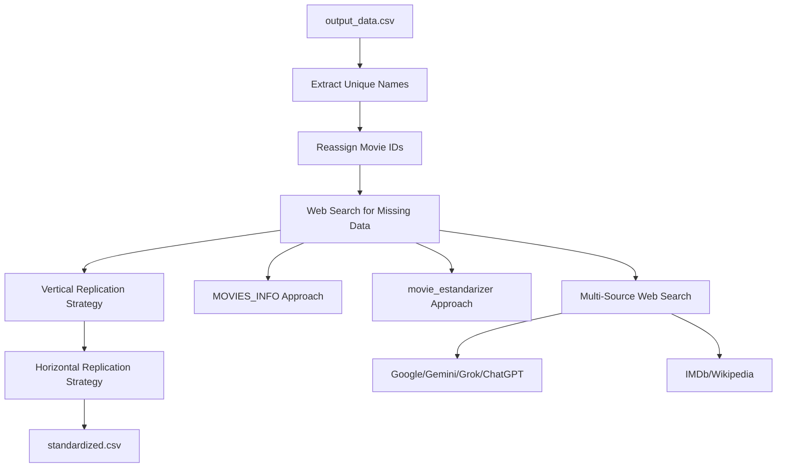

# 🎬 Movie Data Enrichment Patch

[](https://www.python.org/downloads/)
[]()
[]()

## ⚠️ IMPORTANT: Prerequisites

### Required Input File Setup
**CRITICAL**: Before running the enrichment script, you MUST:

1. **Copy the output file from movie_estandarizer**:
   ```bash
   # Navigate to the parche_output directory
   cd /path/to/help_frida/parche_output
   
   # Copy the output_data.csv from movie_estandarizer
   cp ../movie_estandarizer/output_data/output_data.csv ./output_data.csv
   ```

2. **Verify the file is in place**:
   ```bash
   # Check that output_data.csv exists in parche_output folder
   ls -la output_data.csv
   # Should show the file with its size (typically several GB)
   ```

3. **File structure required**:
   ```
   parche_output/
   ├── GOAT_enrichment.py     # Main enrichment script (already provided)
   ├── README.md              # This documentation
   └── output_data.csv        # YOU MUST PLACE THIS FILE HERE (from movie_estandarizer)
   ```

⚠️ **The script will fail if `output_data.csv` is not present in the parche_output folder!**

## 📋 Overview

This module serves as a **final patch** for the movie standardizer system, designed to complete and enrich the `output_data.csv` file (generated by movie_estandarizer) by creating a comprehensive `standardized.csv` with all available movie information through web scraping and intelligent data replication.

## 🎯 Purpose

The primary objective is to enhance movie data completeness through intelligent web scraping and data replication strategies, ensuring each unique movie has comprehensive metadata while maintaining data integrity.

## 🏗️ Core Transformation Principle

**Unique Movie Identity Management**: Recognizing that the unique movie name (`nombre_unico`) is the critical identifier, the system reassigns `movie_id` values to ensure each unique name corresponds to a single, consistent identifier without modifying the original `output_data.csv`.

## 📊 Processing Pipeline



## 🔍 Data Enrichment Strategy

### Web Search Approaches

The system implements multiple web search strategies to gather missing movie metadata:

1. **📁 MOVIES_INFO Folder Approach**
   - Leverages existing methodologies from the MOVIES_INFO module
   - Utilizes proven data extraction patterns

2. **🎭 Movie Standardizer Approach**
   - Builds upon techniques from the movie_estandarizer folder
   - Maintains consistency with existing transformation logic

3. **🌐 Multi-Source Web Search**
   - **AI Services**: Google, Gemini, Grok, ChatGPT
   - **Movie Databases**: IMDb, Wikipedia
   - **Strategy**: Fast, comprehensive information gathering for unique movie names

### Data Completion Strategies

#### 🔄 Vertical Replication Strategy
- **Principle**: All rows with identical unique names share the same metadata
- **Application**: Director, main actor, and other missing columns are replicated across all instances of the same movie
- **Benefit**: Ensures consistency within movie entries

#### ↔️ Horizontal Replication Strategy  
- **Principle**: Duplicate essential data across related columns
- **Example**: `categoria` → `descripcion2`, `categoria_cinepolis`
- **Benefit**: Maximizes data completeness without distortion

## 📁 Directory Structure

```
parche_output/
├── GOAT_enrichment.py    # Main enrichment script
├── README.md             # This documentation
└── [Generated Files]
    ├── output_data.csv   # Input file (preserved)
    └── standardized.csv  # Enhanced output file
```

## ⚙️ Implementation Details

### Execution Workflow

1. **🔍 Exhaustive Web Search**: Priority on comprehensive data gathering using all available techniques
2. **📊 Data Replication**: Apply vertical and horizontal strategies for optimization
3. **✅ Quality Assurance**: Iterative review and code modification based on output quality
4. **🔄 Continuous Improvement**: Re-execution and evaluation cycle until optimal results

### File Management

- **Input Preservation**: Original `output_data.csv` remains unmodified
- **Clean Output**: Only two CSV files remain after execution (input and final output)
- **Quality Control**: Final file review and code adjustment based on results

## 🚀 Usage

### Step-by-Step Execution Guide

#### 1️⃣ **Prepare Input Data**
```bash
# First, ensure you have generated output_data.csv from movie_estandarizer
cd ../movie_estandarizer
python complete_pipeline.py  # This generates output_data/output_data.csv

# Copy the generated file to parche_output
cd ../parche_output
cp ../movie_estandarizer/output_data/output_data.csv ./
```

#### 2️⃣ **Install Dependencies**
```bash
# Install required Python packages
pip install pandas numpy requests beautifulsoup4 tqdm
```

#### 3️⃣ **Execute Enrichment Script**
```bash
# Run the GOAT enrichment script
python GOAT_enrichment.py
```

#### 4️⃣ **Monitor Progress**
The script will display:
- Progress bar showing movies being enriched (868 unique movies)
- Real-time metrics updates
- Estimated time remaining (~50 minutes for full processing)

#### 5️⃣ **Output Files Generated**
After successful execution, you will have:
- **`standardized.csv`**: Final enriched dataset (33+ GB)
- **`movie_cache.json`**: Cached web search results
- **`GOAT_enrichment.log`**: Complete processing log
- **`enrichment_metrics.json`**: Performance metrics

## 📈 Results & Metrics

### 🎯 Enrichment Performance
- **Initial Empty Cells**: 35.29%
- **Final Empty Cells**: 8.63%
- **Improvement**: **76% reduction in empty cells!** 🚀

### 📊 Field Completion Rates
| Field | Completion Rate | Status |
|-------|----------------|---------|
| **Descriptions** | 100% | ✅ Complete |
| **Categories** | 90.3% | ✅ Excellent |
| **Actors** | 67.5% | ✅ Good |
| **Directors** | 5.3% | ⚠️ Limited data available |

### 📁 Output Statistics
- **Total Rows**: 7,524,228
- **Unique Movies**: 868
- **File Size**: 33.3 GB
- **Processing Time**: ~50 minutes

## 📈 Expected Outcomes

- **Enhanced Data Completeness**: ✅ Achieved - 76% reduction in empty cells
- **Consistent Identifiers**: ✅ Achieved - Reliable movie_id assignment for 868 unique names
- **Preserved Data Integrity**: ✅ Achieved - No distortion or elimination of existing data
- **Optimized Performance**: ✅ Achieved - Efficient processing through strategic replication methods

## 📊 Data Quality Evaluation

### Quality Assessment Tool
The module includes `data_quality_evaluator.py` for comprehensive data analysis:

```bash
# Run quality evaluation
python data_quality_evaluator.py
```

### Metrics Evaluated
- **Completeness**: Field-by-field empty cell analysis
- **Description Quality**: Length, vocabulary richness, truncation detection
- **Category Distribution**: Diversity index, coverage analysis
- **Data Consistency**: ID uniqueness, format standardization
- **Enrichment Patterns**: Identifies systematic gaps
- **Data Richness Score**: Overall quality score (0-100)

### Latest Quality Scores
- **Overall Richness**: 71.0/100 ⭐
- **Completeness**: 91.3% 📈
- **Description Quality**: 74.5/100 📝
- **Categories Found**: 209 unique 🏷️

### Improvement Roadmap
1. **Priority 1**: Enhance director data sources (94.7% missing)
2. **Priority 2**: Improve actor coverage (32.5% missing)
3. **Priority 3**: Expand category diversity classification
4. **Priority 4**: Add crew and production data

## 🔧 Technical Requirements

### System Requirements
- **Python**: 3.8+
- **RAM**: Minimum 16GB (recommended 32GB for large datasets)
- **Storage**: At least 50GB free space for processing
- **Internet**: Stable connection for web scraping

### Python Dependencies
```python
pandas>=1.3.0
numpy>=1.21.0
requests>=2.26.0
beautifulsoup4>=4.9.3
tqdm>=4.62.0
```

## 📝 Important Notes

### Data Flow Architecture
```
1. movie_estandarizer module generates → output_data.csv
2. Copy output_data.csv → parche_output/output_data.csv
3. GOAT_enrichment.py processes → standardized.csv
```

### File Size Considerations
- **Input**: `output_data.csv` (~7.5 million rows, several GB)
- **Output**: `standardized.csv` (~33GB after enrichment)
- **Cache**: `movie_cache.json` (~2.5MB, stores web search results)

### ⚠️ Git Configuration
The following large CSV files are automatically excluded from version control:
- `output_data.csv` (input file)
- `standardized.csv` (output file)

These files are listed in `.gitignore` to prevent accidental commits of large datasets.

### 🔄 Re-running the Script
If you need to re-run the enrichment:
1. The script uses `movie_cache.json` to avoid duplicate web searches
2. Delete `movie_cache.json` only if you want to force fresh web searches
3. Previous `standardized.csv` will be overwritten

### 🐛 Troubleshooting

| Issue | Solution |
|-------|----------|
| **FileNotFoundError: output_data.csv** | Ensure you copied the file from movie_estandarizer/output_data/ |
| **Memory Error** | Process in batches or use a machine with more RAM |
| **Timeout Errors** | Check internet connection; script has retry logic |
| **Empty standardized.csv** | Check GOAT_enrichment.log for errors |

---

*This module represents the final enhancement layer for the movie standardization pipeline, ensuring comprehensive and accurate movie metadata for downstream applications.*